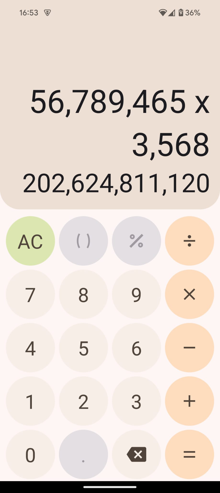

# Calculator App

Calculator app designed to execute integer arithmetic calculations.

## Assumptions

- No brackets are allowed.
- Only one operator can be entered for each calculation.

## Limitations

- App was optimised for use on an Android device with an aspect ratio of 20:9; if the device's aspect ratio is drastically different, the results may not show correctly.

- Only one calculation can be carried out at a time; the result of one can not be used directly in a subsequent one.

- Font size is not capped, if very large operands are entered they can become difficult to read.

- After the result is calculated, the value of the second operand and the operator can still be changed, but not the first operand.

## Install and setup instructions

Clone repo
Open terminal in repo's directory
Run `npm i` to install dependencies

Ensure Expo Go is installed on a mobile device (It can be installed from the Play store / App store)

Run `npm run start`
This will run the command and create a QR code in the terminal. On Android scan the QR code from the Expo Go app. On IOS scan it using the camera app and click to open it using Expo Go. Ensure devices are on the same network.

If Expo Go cannot load the app, try the following command instead.
`npm run start:tunnel`
This will run it in tunnelling mode and makes it available outside of the local network.

## Usage instructions

Enter the value of the first operand using the number keys (If value is negative press `-` before entering the value).
Press one of the operator buttons.
Enter the value of the second operand, if negative value is required press `-` before entering any numbers.
To calculate the result click `=`.

The operator of the calculation can be changed by pressing on a different operator, this will keep the operands the same. `=` needs to be pressed after changing the operator.
